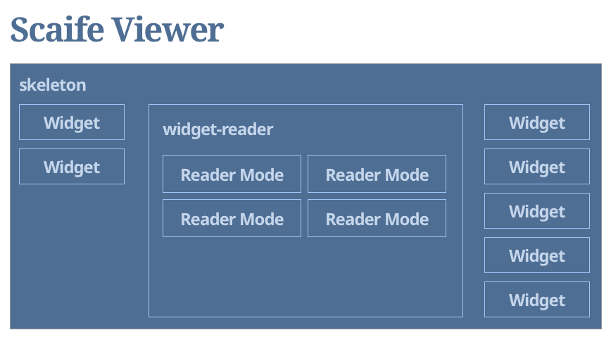

# Scaife Viewer Frontend




## Development

There is a host environment setup under `./src` that you can run by executing:

```
yarn serve
```

This will create a live environment that will auto-reload when changing any
source in any of the packages being used.  Be warned, that development in Safari
is problematic due to the browser over-caching.  Use FireFox or Chrome for most
reliable development experience.

You can build packages by running:

```
yarn build
```

